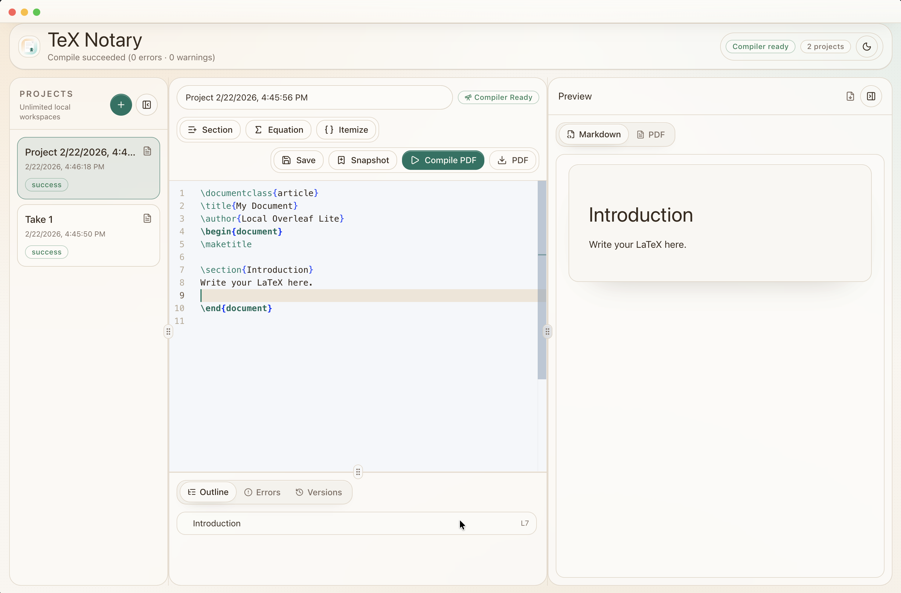

# TeX Notary

TeX Notary is a desktop-first, local-first LaTeX workspace for people who want full control over writing and publishing technical documents.

No project limits. No cloud lock-in. No forced collaboration model.



## Why TeX Notary

TeX Notary is built for focused solo workflows:

- Write in Monaco with LaTeX snippets and syntax highlighting.
- Track your work with snapshot history and one-click restore.
- Navigate quickly with section outline and error panel.
- Preview instantly in Markdown while you edit.
- Compile production PDF on demand.
- Keep everything local in SQLite + local files.

## Offline-First Behavior

After download, TeX Notary works offline for:

- editing
- project management
- snapshots/version timeline
- Markdown preview

PDF compile is also local, with one caveat: first-time LaTeX package fetches may require internet depending on your document and compiler cache state. After packages are cached, compile works offline.

## Security and Trust Notes

TeX Notary does not require cloud sync to function. Your projects remain on your machine by default.

If you see OS trust warnings during install/open:

- macOS: Gatekeeper can show “damaged/can’t be opened” for unsigned/unnotarized binaries.
- Windows: SmartScreen may show “unknown publisher” for unsigned binaries.
- Linux: some distros require trust/permission confirmation for new binaries.

These are code-signing and reputation checks, not signs of data exfiltration or malware by themselves.

## Platforms

Desktop artifacts are published for:

- macOS
- Windows
- Linux

Download from [GitHub Releases](https://github.com/vatsalsaglani/tex-notary/releases).

## Monorepo Layout

- `apps/api` - Express + TypeScript backend and SQLite persistence.
- `apps/web` - React + Vite + Tailwind/shadcn-style UI.
- `apps/desktop` - Electron shell, packaging, and bundled binaries.
- `packages/shared` - shared type contracts.
- `.data` - runtime SQLite DB, temp files, and generated PDFs.

## Internal Documentation

- Architecture and flow: [`docs/internal/architecture.md`](docs/internal/architecture.md)
- Codebase map: [`docs/internal/codebase.md`](docs/internal/codebase.md)
- API contracts: [`docs/internal/api.md`](docs/internal/api.md)
- Database schema and persistence: [`docs/internal/database.md`](docs/internal/database.md)
- Dependencies, runtime/build loading: [`docs/internal/dependencies-runtime.md`](docs/internal/dependencies-runtime.md)
- Build, release, and CI/CD: [`docs/internal/build-release.md`](docs/internal/build-release.md)

## Local Development

### Prerequisites

- Node.js 22+
- npm 10+
- Pandoc installed locally (`pandoc --version`)
- Optional for fallback compile paths in web/API mode: Docker daemon

### Run Web + API

```bash
npm install
npm run dev:api
npm run dev:web
```

Open [http://localhost:5173](http://localhost:5173).

### Run Desktop (Dev)

```bash
npm install
npm run prepare:tools
npm run dev:web
npm run dev:desktop
```

### Build Desktop Installers

```bash
npm run dist:desktop
```

### Landing Page Deployment (GitHub Pages)

- Source folder: `landing/`
- Workflow: `.github/workflows/landing-pages.yml`
- Target URL: `https://vatsalsaglani.github.io/tex-notary/`

Set GitHub Pages source to **GitHub Actions** in repository settings.

### Troubleshooting

`better-sqlite3` ABI mismatch (`NODE_MODULE_VERSION` errors):

```bash
npm run fix:native
```

If packaged Electron app shows a `better-sqlite3` mismatch:

```bash
npm run rebuild:native -w @overleaf-lite/desktop
npm run dist:desktop
```

Compiler unavailable:

- For desktop builds, run `npm run prepare:tectonic` (or `npm run prepare:tools`) and rebuild.
- For web/API mode, install one local compiler (`tectonic`, `latexmk`, or `pdflatex`) or run Docker.
- Check health endpoint: `GET /api/health`.

## License

No license file is currently defined in this repository.
