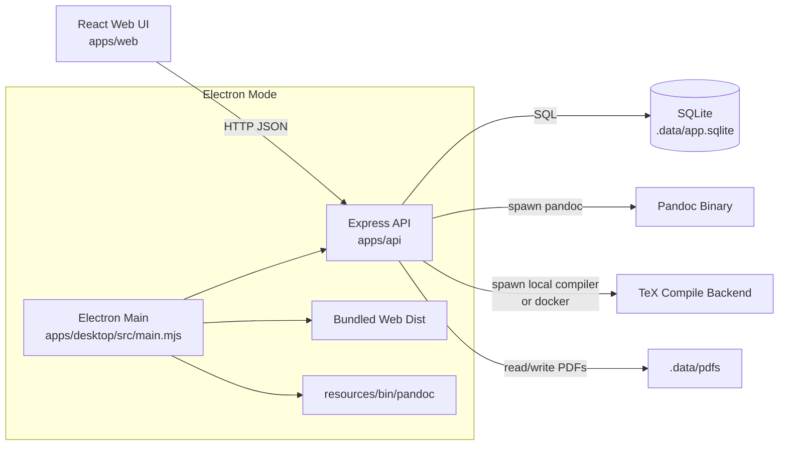
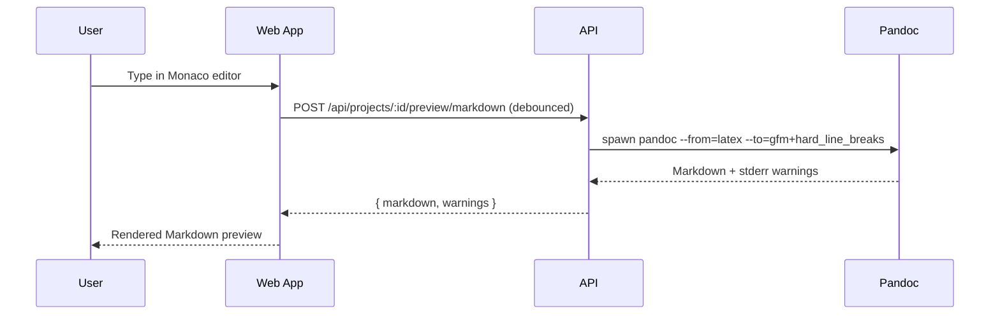
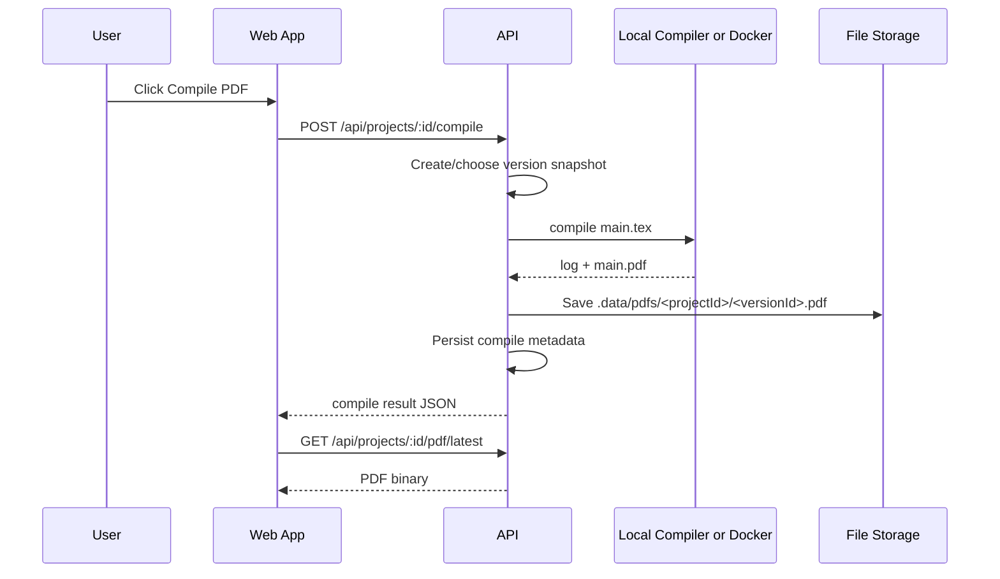

# Internal Architecture

## High-Level Design

TeX Notary is a local-first monorepo with three runtime surfaces:

1. Web app (`apps/web`) for editing and preview UX.
2. API (`apps/api`) for persistence, compilation, and conversion.
3. Desktop shell (`apps/desktop`) that embeds the API and web bundle.

## Runtime Topology

## Request Flow (Typical)

### Edit + Markdown Preview

### Compile + PDF Preview

## Compile Backend Selection

Compile backend is resolved in `apps/api/src/services/compile.ts`:

- Preference from `LATEX_COMPILE_BACKEND`: `auto | local | docker`.
- Local compiler detection order: `tectonic` -> `latexmk` -> `pdflatex`.
- `auto` prefers local compiler, falls back to Docker if available.

## Data Locations

- SQLite DB: `.data/app.sqlite`
- Compile temp dirs: `.data/tmp/*`
- PDFs: `.data/pdfs/<projectId>/<versionId>.pdf`

`DATA_ROOT` env var can override `.data` location.
